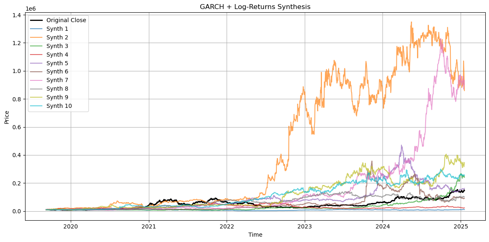
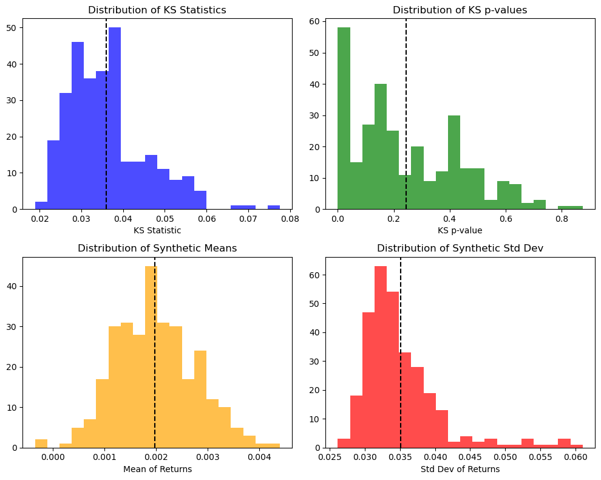

# GARCH-Synthesizer

GARCH-Synthesizer is a Python toolkit for generating synthetic financial time series data using GARCH models with ARX mean specifications. It simulates OHLC (Open, High, Low, Close) price data by modeling log-returns and incorporates multithreading for efficient simulation of multiple synthetic datasets. Additionally, the package includes routines for data quality testing and visualization.

## Features

- **Synthetic Data Generation:** Generate synthetic financial series using a GARCH model on log-returns with an ARX mean specification.
- **Customizable Lag Structure:** Easily specify lag orders for the ARX mean model.
- **Exogenous Variables Support:** Optionally incorporate exogenous variables (e.g., volume percentage changes) into the mean model.
- **Multithreading:** Uses Python’s `ThreadPoolExecutor` to run multiple simulation paths concurrently.
- **Regime-Adaptive Modeling:** Optionally split data into regimes and chain simulations for each regime.
- **Data Quality Testing:** Includes statistical tests (e.g., Kolmogorov-Smirnov test, mean/std comparison, autocorrelation analysis) to assess the quality of the synthetic data.
- **Visualization:** Plot synthetic paths and summary histograms for quick evaluation of the simulation performance.


## Requirements

- Python 3.7+
- [pandas](https://pandas.pydata.org/)
- [numpy](https://numpy.org/)
- [matplotlib](https://matplotlib.org/)
- [arch](https://bashtage.github.io/arch/)
- [scipy](https://www.scipy.org/)
- [statsmodels](https://www.statsmodels.org/)

## Installation

1. **Clone the repository:**

   ```bash
   git clone https://github.com/ekoshv/GARCH-Synthesizer.git
   cd GARCH-Synthesizer
